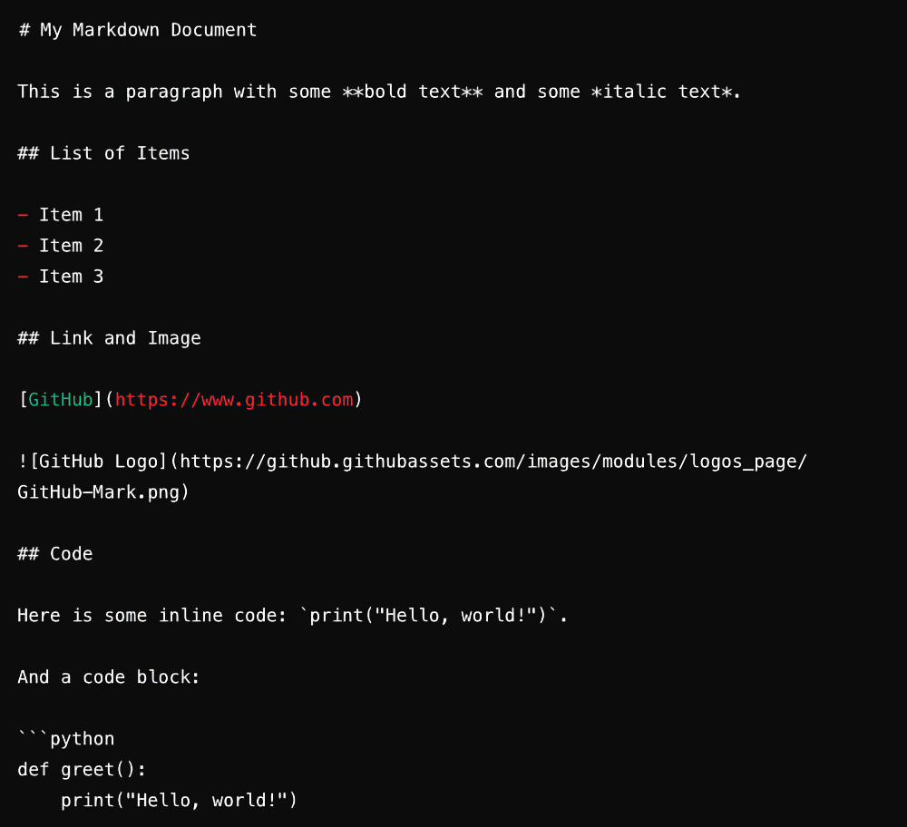

### Here's an example of a simple Markdown document:

### Advanced tips and ticks

https://github.com/MishManners/GitHub-Like-A-Boss/blob/main/markdowntricks.md

- Keboard tags
- Visualizing hex codes
- Visualizing diffs ❤️💚
- Drag and drop images to your Markdown file 🖼️
- Creating tables 📃
- To-do lists ✅

